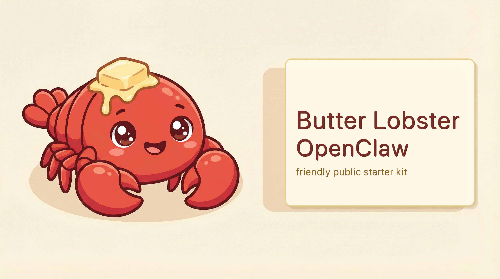

# butter-lobster-openclaw



바로 가져다 쓸 수 있는 **OpenClaw 공개 스타터**입니다.

목표:
- 처음 설치한 사람이 빠르게 실행해보기
- 프롬프트/운영 규칙(md)과 예시 스킬을 재사용
- 개인 정보 없이 안전하게 공개/공유

---

## 1) 빠른 시작

```bash
git clone https://github.com/Jaeyeong-CHOI/butter-lobster-openclaw.git
cd butter-lobster-openclaw
mkdir -p ~/.openclaw
cp starter/openclaw.sample.json ~/.openclaw/openclaw.json
```

그 다음 `~/.openclaw/openclaw.json`에서 토큰/채널 설정만 채우면 됩니다.

Gateway 실행:

```bash
openclaw gateway start
openclaw gateway status
```

---

## 2) 포함된 것

- 운영 프롬프트/규칙 md
  - `AGENTS.md`, `SOUL.md`, `HEARTBEAT.md`, `docs/*`
- 재사용 프롬프트 템플릿
  - `agent-prompts/*`
- 예시 스킬 (보고서/슬라이드 포맷)
  - `skills/latex-report-format/*`
  - 배포 패키지: `skills/dist/latex-report-format.skill`
- 모델 라우팅 유틸
  - `config/sync_acp_default_agent.py`

---

## 3) 공개 전 프라이버시 체크

개인/프로젝트 식별자가 남지 않았는지 확인:

```bash
scripts/privacy_check.sh
```

원하면 키워드를 추가해서 검사 범위를 넓히세요.

---

## 4) 커스터마이즈 포인트

- 본인 스타일: `SOUL.md`
- 작업 규칙: `AGENTS.md`
- 주기 점검: `HEARTBEAT.md`
- 포맷 스킬: `skills/latex-report-format/`

---

## 5) 주의

- 실제 비밀키/토큰은 절대 repo에 커밋하지 마세요.
- 공개용/개인용 워크스페이스를 분리해서 운영하는 것을 권장합니다.
